# General Turning Formulas and Definitions:  
When machining in lathes, turning centers, or multi-task machines, calculating the correct values for different machining parameters like cutting speed and spindle speed is a crucial factor for good results. In this section, you will find the formulas and definitions needed for general turning.   
| metric |      | imperial |  
|----|----|----|    
|Cutting speed $vc (m/min)$|      |Cutting speed $vc (ft/min)$|  
|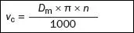|     |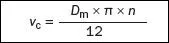|  
|Spindle speed $n (rpm)$|      |Spindle speed $n (rpm)$|  
|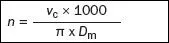|      |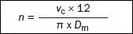|  
|Metal removal rate $Q(cm^3/min)$|      |Metal removal rate $Q(cm^3/min)$|  
||      |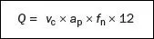|  
|Net power $Pc(kW)$|      |Net power $Pc(HP)$|  
|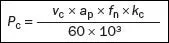|      |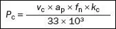|  
|Machining time $Tc(min)$|      |Machining time $Tc(min)$|  
|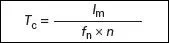|      ||  

|Symbol	|Designation/definition	|Unit, metric |(imperial)|  
|--|--|--|--|
|Dm​	|Machined diameter mm (inch)|​	mm |(inch)|​
|fn	|Feed per revolution​	|mm/r |(inch/r)|​
|ap​	|Cutting depth ​	|mm |(inch)|​
|vc	|Cutting speed|​	m/min |(feet/min)|​
|n	|Spindle speed	|rpm|rpm|​​
|Pc​|	Net power|	kW |(HP)|
|Q	|Metal removal rate	|cm3/min |(inch3/min)|
|hm​	|Average chip thickness​	|mm |(inch)|
|hex	|Maximum chip thickness	|mm |(inch)|
|Tc​	|Period of engagement​	|min||​
|lm	|Machined length​	|mm |(inch)|
|kc​	|Specific cutting force	|N/mm2 |(N/inch2)|
|KAPR​	|Entering angle|	degree||​
|PSIR​​	|Lead angle​	|degree||  
​

# Milling Formulas and Definitions:
Here you will find a collection of good to have milling formulas and definitions that are used when it comes to the milling process, milling cutters, milling techniques, and more. Knowing how to calculate correct cutting speed, feed per tooth, or metal removal rate is crucial for good results in any milling operation.  
  
| metric |      | imperial |  
|------|--------|------|  
|Table feed, $v(mm/min)$|       |Table feed, $(inch/min)$|
|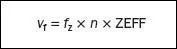|       | |  
|Cutting speed, $(m/min)$|      |Cutting speed, $(ft/min)$|
|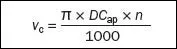||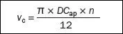|
|Spindel speed, $n(n/min)$|     |Spindel speed, $(n/rpm)$|  
|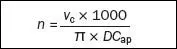|      |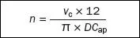|  
|Feed per tooth, $f(mm)$|       |Feed per tooth, $f(inch)$|
||     |  
|Feed per revolution, $f(mm/rev)|       |Feed per revolution, $f(inch/rev)|  
||        ||  
|Metal removal rate, $Q (cm/min)$|      |Metal removal rate, $Q (inch/min$)|  
||     |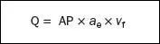|  
|Net power, $P(kW)$|        |Net power, $P(HP)$|  
|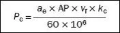|     |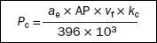|  
|Torque, $M(Nm)$|       |Torque, $M(.lbf ft)$|  
|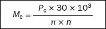|       |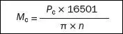|  

|Symbol	|Designation/definition	|Metric	|Imperial|  
|---|---|---|---|  
|$ae$	|Radial depth of cut	|mm	|inch|  
|$ap$	|Axial depth of cut	|mm	|inch|  
|$DCap$	|Cutting diameter at cutting depth $ap$	|mm	|inch|  
|$Dm$	|Machined diameter (component diameter)	|mm	|inch|  
|$fz$	|Feed per tooth	|mm	|inch|  
|$fn$	|Feed per revolution	|mm/rev	|inch/rev| 
|$n$	|Spindle speed	|rpm	|rpm|  
|$vc$	|Cutting speed	|m/min	|ft/min|  
|$ve$	|Effective cutting speed	|mm/min	|inch/min|
|$vf$	|Table feed	|mm/min	|inch/min|
|$zc$	|Number of effective teeth	|pcs	|pcs|  
|$hex$	|Maximum chip thickness	|mm	|inch|
|$hm$	|Average chip thickness	|mm	|inch|  
|$kc$	|Specific cutting force	|$N/mm^2$	|$N/inch^2$|  
|$Pc$	|Net power	|kW	HP|  
|$Mc$	|Torque	|Nm	|lbf ft|  
|$Q$	|Metal removal rate	|$cm^3/min$	|$inch^3/min$|
|KAPR	|Entering angle	|degree||	
|PSIR	|Lead angle||degree|  
|BD	|Body diameter	|mm	|inch|  
|DC	|Cutting diameter	|mm	|inch|  
|LU	|Usable length	|mm	|inch|  
   

