# Machining Formulas (V3) — Turning/Milling + Material Mass + (Opsiyonel) Ollama

Bu depo; tornalama ve frezeleme için temel talaşlı imalat formüllerini, ayrıca şekle bağlı malzeme kütlesi hesabını sunar. Güncel uygulama Tkinter tabanlı **V3 GUI** ile gelir ve giriş noktası **`python -m machining_formulas`**’dır.

## 🚀 Hızlı Başlangıç

- Python: 3.10+
- Kurulum: `requirements.txt` + proje paketi kurulumu
- Çalıştırma (V3 GUI): `python -m machining_formulas`

### Ollama (opsiyonel)

V3 arayüzünde Ollama URL ve model seçimi yapılabilir. Varsayılan istekler genellikle:

- `.../api/tags` (model listesi)
- `.../api/chat` (sohbet)

> Not: Depoda `/v1/*` (OpenAI-uyumlu) uç noktaları için de yardımcı fonksiyonlar ve fallback mantığı bulunur.

### 🧠 Tool-calling (Araç Çağrısı) örnekleri

V3 GUI içindeki sohbet alanına bir hesap sorusu yazdığınızda uygulama, yanıtı **metin olarak uydurmak** yerine çoğu durumda bir “tool” (fonksiyon) çağrısı yaptırarak sonucu doğrudan hesaplatır.

Bu tool isimlerini sizin yazmanız gerekmez; amaç, **hangi tip soruların araç çağrısına dönüştüğünü** görünür kılmaktır. Örnekler:

1) Tornalama – Kesme hızı ($Vc$)
   - Kullanıcı sorusu: “Çap 50 mm, 1000 rpm iken kesme hızı nedir?”
   - İçeride çağrılan tool:

```json
{ "name": "calculate_turning_cutting_speed", "arguments": { "Dm": 50, "n": 1000 } }
```

2) Tornalama – Net güç ($Pc$)
   - Kullanıcı sorusu: “Vc=180 m/min, ap=3 mm, fn=0.2 mm/rev, kc=2000 N/mm² için net güç?”
   - İçeride çağrılan tool:

```json
{ "name": "calculate_turning_net_power", "arguments": { "Vc": 180, "ap": 3, "fn": 0.2, "kc": 2000 } }
```

3) Frezeleme – Tabla ilerlemesi ($Vf$)
   - Kullanıcı sorusu: “fz=0.10 mm, n=1200 rpm, ZEFF=4 için tabla ilerlemesi kaç mm/dak?”
   - İçeride çağrılan tool:

```json
{ "name": "calculate_milling_table_feed", "arguments": { "fz": 0.1, "n": 1200, "ZEFF": 4 } }
```

4) Frezeleme – Tork ($M$)
   - Kullanıcı sorusu: “Pc=3 kW ve n=1600 rpm ise tork nedir?”
   - İçeride çağrılan tool:

```json
{ "name": "calculate_milling_torque", "arguments": { "Pc": 3, "n": 1600 } }
```

5) Malzeme kütlesi (şekil + yoğunluk)
   - Kullanıcı sorusu: “Yarıçap 25 mm, uzunluk 200 mm, yoğunluk 7.8 g/cm³ olan dairesel malzemenin kütlesi?”
   - İçeride çağrılan tool:

```json
{ "name": "calculate_material_mass", "arguments": { "shape_key": "circle", "density": 7.8, "length": 200, "radius": 25 } }
```

> İpucu: Tool-calling’in doğru çalışması için soruda birimleriyle birlikte değerleri (mm, rpm, m/min, kW…) belirtmek en iyi sonucu verir.

### `src/` layout notu

Bu repo `src/` layout kullanır. Bu yüzden `python -m machining_formulas` çalıştırmadan önce proje paketini kurmanız gerekir.

- Geliştirme (önerilen): `pip install -e .`
- Alternatif: `pip install .`
- Alternatif (kurulum yapmadan): `PYTHONPATH=src python -m machining_formulas`

### Test

- Pytest: `pytest tests/`  
   (Repo `src/` layout kullandığı için, bazı ortamlarda `PYTHONPATH=.` ile çalıştırmak daha sorunsuz olabilir.)

When machining in lathes, turning centers, or multi-task machines, calculating the correct values for different machining parameters like cutting speed and spindle speed is a crucial factor for good results. In this section, you will find the formulas and definitions needed for general turning.

| metric |      | imperial |  
|----|----|----|
|Cutting speed $vc (m/min)$|      |Cutting speed $vc (ft/min)$|  
|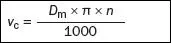|     |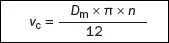|  
|Spindle speed $n (rpm)$|      |Spindle speed $n (rpm)$|  
|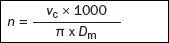|      |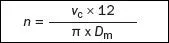|  
|Metal removal rate $Q(cm^3/min)$|      |Metal removal rate $Q(cm^3/min)$|  
||      |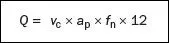|  
|Net power $Pc(kW)$|      |Net power $Pc(HP)$|  
|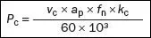|      |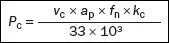|  
|Machining time $Tc(min)$|      |Machining time $Tc(min)$|  
|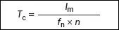|      ||  

|Symbol |Designation/definition |Unit, metric |(imperial)|  
|--|--|--|--|
|$Dm$ |Machined diameter mm (inch)| mm |(inch)|
|$fn$ |Feed per revolution |mm/r |(inch/r)|
|$ap$ |Cutting depth |mm |(inch)|
|$vc$ |Cutting speed| m/min |(feet/min)|
|$n$ |Spindle speed |rpm|rpm|
|$Pc$| Net power| kW |HP|
|$Q$ |Metal removal rate |$cm^3/min$ |$(inch^3/min)$|
|$hm$ |Average chip thickness |mm |(inch)|
|$hex$ |Maximum chip thickness |mm |(inch)|
|$Tc$ |Period of engagement |min||
|$lm$ |Machined length |mm |(inch)|
|$kc$ |Specific cutting force |N/mm2 |(N/inch2)|
|KAPR |Entering angle| degree||
|PSIR |Lead angle |degree||  

## Milling Formulas and Definitions

Here you will find a collection of good to have milling formulas and definitions that are used when it comes to the milling process, milling cutters, milling techniques, and more. Knowing how to calculate correct cutting speed, feed per tooth, or metal removal rate is crucial for good results in any milling operation.  
  
| metric |      | imperial |  
|------|--------|------|  
|Table feed, $v(mm/min)$|       |Table feed, $(inch/min)$|
|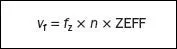|       | |  
|Cutting speed, $(m/min)$|      |Cutting speed, $(ft/min)$|
|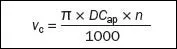||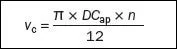|
|Spindel speed, $n(n/min)$|     |Spindel speed, $(n/rpm)$|  
|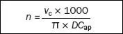|      |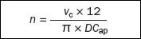|  
|Feed per tooth, $f(mm)$|       |Feed per tooth, $f(inch)$|
||     | |
|Feed per revolution, $f(mm/rev)|       |Feed per revolution, $f(inch/rev)|  
||        ||  
|Metal removal rate, $Q (cm/min)$|      |Metal removal rate, $Q (inch/min$)|  
|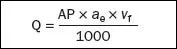|     |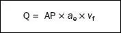|  
|Net power, $P(kW)$|        |Net power, $P(HP)$|  
|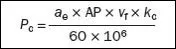|     |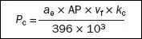|  
|Torque, $M(Nm)$|       |Torque, $M(.lbf ft)$|  
|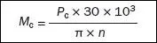|       |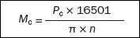|  

|Symbol |Designation/definition |Metric |Imperial|  
|---|---|---|---|  
## 🧰 Kurulum ve Çalıştırma (V3)

1) Bağımlılıkları kurun:

```bash
pip install -r requirements.txt

# Proje paketini kurun (src/ layout)
pip install -e .
```

2) V3 GUI’yi başlatın:

```bash
python -m machining_formulas
```

### Legacy notu (V1/V2)

Bu repo artık **V3** akışını esas alır. Kök dizindeki bazı eski başlatıcı betikler/dosyalar (örn. `run_v2.sh`, `requirements_v2.txt`) varsa bile dokümantasyon odağı V3’tür.

```bash
pip install -r requirements_v2.txt
```

#### Temel Bağımlılıklar (Her İki Sistem İçin):
- `requests>=2.25.0` - Ollama API iletişimi
- `markdown>=3.3.0` - Dokümantasyon ve tooltips
- `pytest>=7.0.0` - Test framework
- `tkinter` - GUI framework (genellikle Python ile birlikte gelir)

#### Not: 
- Eğer tkinter kurulu değilse: `pip install tk` (Ubuntu/Debian için: `sudo apt-get install python3-tk`)
- Geliştirme için ek bağımlılıklar `requirements_v2.txt` içinde yorum satırı olarak mevcuttur

2. **Ollama'yı Çalıştırın:** Ollama sunucunuzun çalıştığından ve istediğiniz modelin kullanılabilir olduğundan emin olun. Uygulama varsayılan olarak yerel makinenizdeki `http://localhost:11434` uç noktasını kullanır. Bağlantı altyapısı hem `/v1/chat` (önerilen, tool-calling için) hem de `/api/chat` protokolleri için otomatik geçiş ve fallback desteğine sahiptir.
3. **Uygulamayı Çalıştırın:**

   ```bash
   python -m machining_formulas
   ```

4. **AI ile Etkileşim:**
    - Manuel hesaplamalar için açılır menüden bir hesaplama türü seçin.
    - Veya sorunuzu doğrudan sohbet giriş alanına yazın ve "Ollama'ya Gönder" düğmesine basın. AI ya metinle yanıt verecek ya da bir hesaplama yapıp sonucu gösterecektir.

### Kullanım Kılavuzu

Bu kılavuz, size verilen araçları daha verimli kullanmanıza yardımcı olacak şekilde düzenlenmiştir. Aşağıda her bir aracın açıklaması ve kullanımı detaylandırılmıştır.

#### Tornalama Hesaplamaları

1. **Kesme Hızı (Cutting Speed)**
   - **Açıklama:** Tornalama işleminde kesme hızı hesaplar.
   - **Parametreler:**
     - `Dm`: İşlenen Çap (mm)
     - `n`: İş Mili Devri (rpm)

2. **İş Mili Hızı (Spindle Speed)**
   - **Açıklama:** Tornalama işleminde iş mili hızı hesaplar.
   - **Parametreler:**
     - `Vc`: Kesme Hızı (m/min)
     - `Dm`: İşlenen Çap (mm)

3. **Metal Kaldırma Oranı (Metal Removal Rate)**
   - **Açıklama:** Tornalama işleminde metal kaldırma oranı hesaplar.
   - **Parametreler:**
     - `Vc`: Kesme Hızı (m/min)
     - `ap`: Kesme Derinliği (mm)
     - `fn`: Devir Başına İlerleme (mm/rev)

4. **Net Güç (Net Power)**
   - **Açıklama:** Tornalama işleminde net güç hesaplar.
   - **Parametreler:**
     - `Vc`: Kesme Hızı (m/min)
     - `ap`: Kesme Derinliği (mm)
     - `fn`: Devir Başına İlerleme (mm/rev)
     - `kc`: Özgül Kesme Kuvveti (N/mm²)

5. **İşlem Süresi (Machining Time)**
   - **Açıklama:** Tornalama işleminde işlem süresi hesaplar.
   - **Parametreler:**
     - `lm`: İşlenecek Uzunluk (mm)
     - `fn`: Devir Başına İlerleme (mm/rev)
     - `n`: İş Mili Devri (rpm)

#### Frezeleme Hesaplamaları

1. **Tabla İlerlemesi (Table Feed)**
   - **Açıklama:** Frezeleme işleminde tabla ilerlemesini hesaplar.
   - **Parametreler:**
     - `fz`: Diş Başına İlerleme (mm)
     - `n`: İş Mili Devri (rpm)
     - `ZEFF`: Efektif Diş Sayısı

2. **Kesme Hızı (Cutting Speed)**
   - **Açıklama:** Frezeleme işleminde kesme hızı hesaplar.
   - **Parametreler:**
     - `DCap`: Kesme Çapı (Takım) (mm)
     - `n`: İş Mili Devri (rpm)

3. **İş Mili Hızı (Spindle Speed)**
   - **Açıklama:** Frezeleme işleminde iş mili hızı hesaplar.
   - **Parametreler:**
     - `Vc`: Kesme Hızı (m/min)
     - `DCap`: Kesme Çapı (Takım) (mm)

4. **Diş Başına İlerleme (Feed per Tooth)**
   - **Açıklama:** Frezeleme işleminde diş başına ilerlemesini hesaplar.
   - **Parametreler:**
     - `Vf`: Tabla İlerlemesi (mm/min)
     - `ZEFF`: Efektif Diş Sayısı
     - `n`: İş Mili Devri (rpm)

5. **Devir Başına İlerleme (Feed per Revolution)**
   - **Açıklama:** Frezeleme işleminde devir başına ilerlemesini hesaplar.
   - **Parametreler:**
     - `Vf`: Tabla İlerlemesi (mm/min)
     - `n`: İş Mili Devri (rpm)

6. **Metal Kaldırma Oranı (Metal Removal Rate)**
   - **Açıklama:** Frezeleme işleminde metal kaldırma oranı hesaplar.
   - **Parametreler:**
     - `Vf`: Tabla İlerlemesi (mm/min)
     - `ae`: Yanal Kesme Derinliği (mm)
     - `ap`: Kesme Derinliği (mm)

7. **Net Güç (Net Power)**
   - **Açıklama:** Frezeleme işleminde net güç hesaplar.
   - **Parametreler:**
     - `Vf`: Tabla İlerlemesi (mm/min)
     - `ae`: Yanal Kesme Derinliği (mm)
     - `ap`: Kesme Derinliği (mm)
     - `kc`: Özgül Kesme Kuvveti (N/mm²)

8. **Tork (Torque)**
   - **Açıklama:** Frezeleme işleminde tork hesaplar.
   - **Parametreler:**
     - `Pc`: Net Güç (kW)
     - `n`: İş Mili Devri (rpm)

#### Malzeme Kütlesi Hesaplaması

- **Malzeme Kütlesi**
  - **Açıklama:** Belirli bir şekil ve yoğunluk için malzeme kütlesini hesaplar.
  - **Parametreler:**
    - `shape_key`: Malzemenin şekli (örn: triangle, circle, semi-circle, square, rectangle, parallelogram, rhombus, trapezium, kite, pentagon, hexagon, octagon, nonagon, decagon)
    - `density`: Malzeme yoğunluğu (g/cm³)
    - `length`: Ekstrüzyon uzunluğu (mm)

## Örnek Promptlar

### Tornalama Hesaplamaları (Örnekler)

1. **Cutting Speed (Kesme Hızı)**
   - "Çapı 50 mm olan bir parçayı 1000 rpm'de işlerken kesme hızı nedir?"
2. **Spindle Speed (İş Mili Hızı)**
   - "Kesme hızı 200 m/min olan bir parçanın çapı 60 mm ise iş mili hızı nedir?"
3. **Metal Removal Rate (Metal Kaldırma Oranı)**
   - "Kesme hızı 150 m/min, kesme derinliği 2 mm ve devir başına ilerleme 0.1 mm/rev olan bir işlemde metal kaldırma oranı nedir?"
4. **Net Power (Net Güç)**
   - "Kesme hızı 180 m/min, kesme derinliği 3 mm, devir başına ilerleme 0.2 mm/rev ve özgül kesme kuvveti 2000 N/mm² olan bir işlemde net güç nedir?"
5. **Machining Time (İşleme Süresi)**
   - "Devir başına ilerleme 0.1 mm/rev, işlenecek uzunluk 100 mm ve iş mili devri 800 rpm olan bir işlemde işleme süresi nedir?"

#### Frezeleme Hesaplamaları (Örnekler)

1. **Table Feed (Tabla İlerlemesi)**
   - "Efektif diş sayısı 4, diş başına ilerleme 0.1 mm ve iş mili devri 1200 rpm olan bir frezeleme işleminde tabla ilerlemesi nedir?"
2. **Cutting Speed (Kesme Hızı)**
   - "Kesme çapı 20 mm ve iş mili devri 1500 rpm olan bir frezeleme işleminde kesme hızı nedir?"
3. **Spindle Speed (İş Mili Hızı)**
   - "Kesme hızı 300 m/min ve kesme çapı 25 mm olan bir frezeleme işleminde iş mili hızı nedir?"
4. **Feed per Tooth (Diş Başına İlerleme)**
   - "Tabla ilerlemesi 100 mm/min, efektif diş sayısı 6 ve iş mili devri 1400 rpm olan bir frezeleme işleminde diş başına ilerleme nedir?"
5. **Feed per Revolution (Devir Başına İlerleme)**
   - "Tabla ilerlemesi 200 mm/min ve iş mili devri 900 rpm olan bir frezeleme işleminde devir başına ilerleme nedir?"
6. **Metal Removal Rate (Metal Kaldırma Oranı)**
   - "Tabla ilerlemesi 150 mm/min, yanal kesme derinliği 4 mm ve kesme derinliği 5 mm olan bir frezeleme işleminde metal kaldırma oranı nedir?"
7. **Net Power (Net Güç)**
   - "Yanal kesme derinliği 3 mm, kesme derinliği 6 mm, tabla ilerlemesi 120 mm/min ve özgül kesme kuvveti 2500 N/mm² olan bir frezeleme işleminde net güç nedir?"
8. **Torque (Tork)**
   - "Net güç 3 kW ve iş mili devri 1600 rpm olan bir frezeleme işleminde tork nedir?"

#### Malzeme Kütlesi Hesaplamaları

1. **Yuvarlak Malzeme**
   - "Çapı 50 mm, uzunluğu 200 mm ve yoğunluğu 7.8 g/cm³ olan bir çelik yuvarlak malzemenin kütlesini hesapla."
2. **Dörtgen Malzeme**
   - "Genişliği 100 mm, yüksekliği 50 mm, uzunluğu 300 mm ve yoğunluğu 2.7 g/cm³ olan bir alüminyum dörtgen malzemenin kütlesini hesapla."
3. **Üçgen Malzeme**
   - "Tabanı 100 mm, yüksekliği 80 mm, uzunluğu 250 mm ve yoğunluğu 8.9 g/cm³ olan bir bakır üçgen malzemenin kütlesini hesapla."

Bu örnek promptlar, verilen kılavuzu kullanarak nasıl daha isabetli cümleler oluşturulabileceğini göstermektedir. Her hesaplama türü için gerekli parametrelerin doğru şekilde belirtilmesi ve sorunun anlaşılır bir şekilde ifade edilmesi önemlidir.

```text
